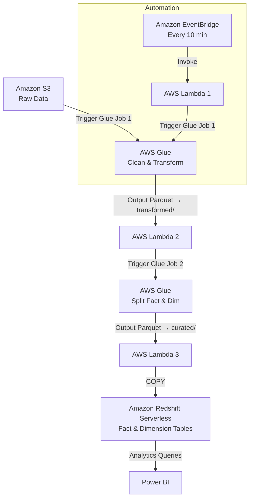

# 🏗️ Data Warehouse Solution on AWS

This project implements an **end-to-end serverless data warehouse solution** on AWS.  
It was built after completing the AWS training *"Building Data Warehouse Solution"* and extended with automation, orchestration, and analytics queries.

---

## 🚀 Project Overview

The pipeline ingests raw sales data from Kaggle, cleans and transforms it using AWS Glue, and loads curated fact/dimension tables into **Amazon Redshift Serverless**.  
It also includes automation with AWS Lambda, EventBridge, and S3 triggers to orchestrate the entire workflow.

---

## 🔄 Data Pipeline Flow



---

## 📂 Project Structure

### 📁 dataset
- `amazon_products_sales_data_uncleaned.csv` → raw dataset (downloaded from Kaggle)

### 📁 scripts
- **automation/**
  - `pipeline_automation.py` → Configure S3 → Lambda 2 → Lambda 3 triggers
- **cleanup/**
  - `delete_resources.py` → Tear down all AWS resources
- **eventbridge/**
  - `eventbridge.py` → Create schedule (every 10 min → Lambda 1)
- **glue/**
  - `create_glue_job.py` → Register Glue jobs
  - `glue_clean_transform.py` → Clean & transform raw CSV → Parquet
  - `glue_split_fact_dim.py` → Split into fact & dimension parquet tables
- **iam/**
  - `create_iam_roles.py` → Provision IAM roles for Glue, Lambda, Redshift
- **lambda/**
  - `deploy_lambdas.py` → Package & deploy Lambda 1/2/3
  - `lambda_1.py` → Start Glue Job 1 (clean + transform)
  - `lambda_2.py` → Start Glue Job 2 (split fact/dim)
  - `lambda_3.py` → Provision Redshift & load curated data
- **redshift/**
  - `create_redshift_serverless.py` → Setup namespace, workgroup, BI user
- **s3/**
  - `create_bucket_and_folders.py` → Create S3 bucket & folder structure
  - `upload_raw_data.py` → Ingest dataset → S3 raw/

### 📄 Root Files
- `redshift_analysis_queries.sql` → SQL queries for insights (10 use cases)  
- `requirements.txt` → Python dependencies

---

## ⚙️ Workflow

1. **Ingestion** → Kaggle dataset uploaded to S3 (`raw/`).
2. **Glue ETL** → Job 1 cleans & transforms → `transformed/`; Job 2 splits → `curated/`.
3. **Automation** → EventBridge triggers Lambda 1; S3 triggers Lambda 2; Glue job triggers Lambda 3.
4. **Data Warehouse** → Curated data loaded into Redshift tables (`fact_sales`, `dim_product`, `dim_date`).
5. **Analysis Layer** → 10 SQL queries provide insights (popularity, pricing, trends). Dashboards can be built in **Power BI**.
6. **Cleanup** → `delete_resources.py` deletes all AWS resources.

---

## 📊 Redshift Schema

- **dim_product**  
  Distribution: `DISTSTYLE ALL`  
  ```sql
  product_name VARCHAR(255),
  category VARCHAR(255)
  ```

- **dim_date**  
  Distribution: `DISTSTYLE ALL`  
  ```sql
  crawl_year INT,
  crawl_month INT
  ```

- **fact_sales**  
  Distribution: `DISTSTYLE KEY (product_name)`  
  Sort Key: `(crawl_year, crawl_month)`  
  ```sql
  product_name,
  current_discounted_price,
  listed_price,
  rating,
  number_of_reviews,
  discount_amount,
  discount_flag,
  rating_bucket,
  crawl_year,
  crawl_month
  ```

---

## 🔑 Key Learnings

- Automating **ETL → Data Warehouse → BI** on AWS with serverless services  
- Secure cross-service access with **IAM roles**  
- Event-driven orchestration with **EventBridge, S3 triggers, and Lambdas**  
- Designing **fact and dimension models** in Redshift  
- Writing analytical SQL for business insights

---

## 🧹 Cleanup

Run:
```bash
python scripts/cleanup/delete_resources.py
```
This removes all AWS resources provisioned for the project.

---

## 🛠️ Requirements

- Python 3.9+  
- boto3, botocore, awscli  
- AWS account with IAM permissions  
- (Optional) KaggleHub for dataset ingestion

Install dependencies:
```bash
pip install -r requirements.txt
```

---

## 📌 Next Steps

- Build **Power BI dashboards** for visualization  
- Store Redshift credentials in **AWS Secrets Manager**  
- Scale Glue/Redshift configs for larger datasets

---

## 🙌 Acknowledgment

This project was created after completing AWS’s training:  
**_"Building Data Warehouse Solution"_**